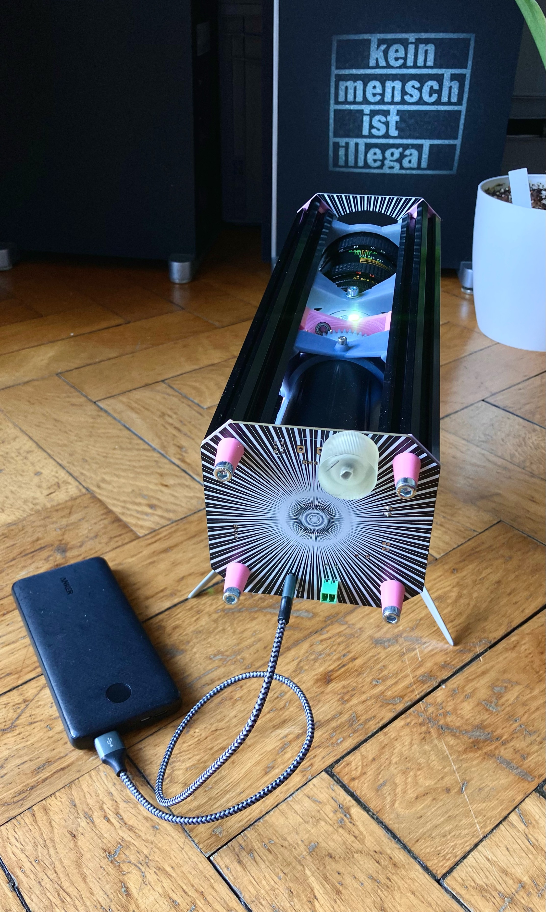
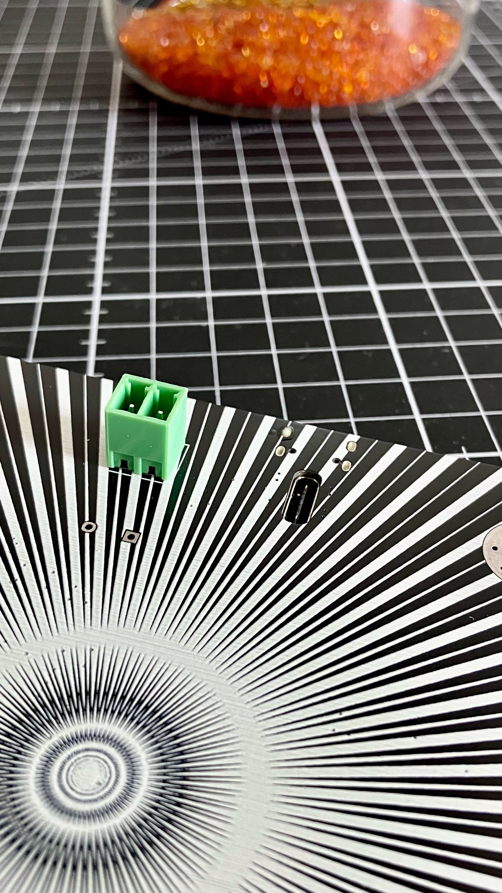
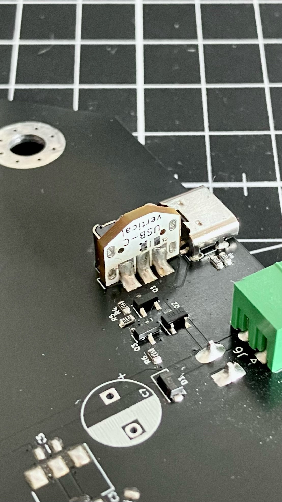
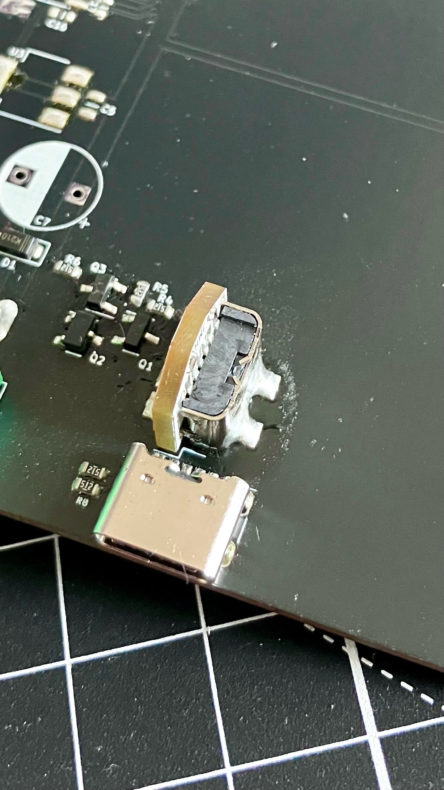

# type-c-recessed

My simple solution of bringing USB Type-C power receptacles flush into circuit boards, thus allowing for beautiful faceplates and PCB based user interfaces.

<table>
  <tbody>
    <tr>
      <td>
        
      </td>
      <td>
        
      </td>
    </tr>
    <tr>
      <td>
        
      </td>
      <td>
        
      </td>
    </tr>
  </tbody>
</table>

## notes

If you want to use this solution, please get the designfiles in the 'hardware files/' folder produced, add a 6-Pin USB-C power only connector and two 5.1k 1% resistors to each board. If neccessary, please also add a 4.7uF cap to the back of each board.

